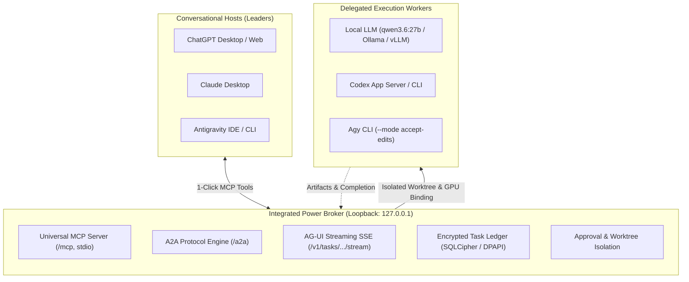

# Integrated Power Control Center & Multi-AI Broker

[](LICENSE)
[](https://github.com/EggR0/integrated-power-control-center/releases)

**Integrated Power Control Center** is a standalone, local-first Multi-AI Loopback Broker and Desktop Management App built with **Tauri 2**.

It connects, bridges, and coordinates **any AI agent or host**—whether you are conversing in **ChatGPT Desktop, Claude Desktop, Antigravity CLI, Local LLMs (Ollama / vLLM / Qwen), or Codex**—without vendor lock-in and without leaving your primary conversation interface.

> 🔗 **Looking for the IDE Extension?** Check out the [Integrated Power VSX Extension](https://github.com/EggR0/integrated-power) for Antigravity IDE and VS Code.

---

## ⚡ Key Capabilities



1. **Universal Model Context Protocol (MCP) Hub**:
   - **ChatGPT Desktop**: 1-click MCP JSON configuration copying. Keeps the active conversation in ChatGPT while delegating coding or heavy tasks to local models or Codex.
   - **Claude Desktop**: 1-click automatic config injection into `%APPDATA%\Claude\claude_desktop_config.json`.
2. **Zero-Config Local LLM Auto-Discovery**:
   - Automatically detects local Ollama / vLLM servers (`127.0.0.1:11435`, `11434`), hardware GPU inventory, and preferred coding models (`qwen3.6:27b`).
3. **Safe Execution & Worktree Isolation**:
   - Code-writing tasks are executed in isolated Git worktrees.
   - Merging changes to the main branch or external transfers require explicit human approval via the Control Center Approval Queue.
4. **Live Token Status & 100% Full Quota Notification**:
   - Live quota tracking for **Gemini 3.1 Pro, Claude Opus 4.6 Thinking, and OpenAI Codex** with SVG gauge rings and reset countdowns.
   - Desktop and in-app notifications dispatched the moment token quotas refill to 100%.
5. **Standalone & Lightweight Desktop App (Tauri 2)**:
   - Runs independently as a native desktop application with Tauri 2 and an embedded Node runtime bundle (`node-runtime.exe`). No IDE installation required.
   - Optional Windows boot auto-start (`HKCU\...\Run`) with a single toggle.
6. **Encrypted Local Ledger & 32k Context**:
   - Task histories and telemetry are stored in an encrypted local ledger (SQLCipher / DPAPI / OS Keyring). Never uploads private conversations or GUI credentials to third-party clouds.
   - 32k (`32,768`) token local context pre-allocation for high-end GPUs and Apple Silicon.

---

## 🚀 Quick Start

### 1. Connecting ChatGPT Desktop
1. Open **Integrated Power Control Center**.
2. Select **ChatGPT** in the *Main Connection Target* dropdown.
3. Click **"📋 ChatGPT MCP 설정 복사"** (Copy ChatGPT MCP JSON).
4. In ChatGPT Desktop, open **Settings > Connectors / MCP** and paste the JSON:
   ```json
   {
     "mcpServers": {
       "integrated-power": {
         "command": "node",
         "args": ["<path-to-control-center>/mcp-server.js"]
       }
     }
   }
   ```
5. You can now prompt ChatGPT: *"Delegate this refactoring task to local Qwen model via Integrated Power"*.

### 2. Connecting Claude Desktop
1. In Control Center, select **Claude Desktop**.
2. Click **"⚡ Claude Desktop 원클릭 등록"** (Auto-Register Claude).
3. Restart Claude Desktop. The `integrated-power` MCP tools are now active.

---

## 🛠️ Development & Build

### Prerequisites
- Node.js 18+ and npm / pnpm
- Rust 1.77+ and Cargo (for Tauri build)
- PowerShell 7+ (on Windows)

### Commands
```bash
# Install dependencies
npm install

# Run Vite frontend dev server
npm run dev

# Run standalone Multi-AI broker
npm run broker

# Build desktop application with Tauri
npm run tauri:build
```

---

## 📜 License

Licensed under the [Apache License, Version 2.0](LICENSE).
Copyright 2026 EggR Open Source Lab.
